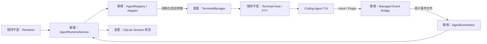

# DevStation MVP 计划

MVP 目标是打通一条本地研发主链路：

```text
任务 → Git 项目 → 工作流 → Agent 会话 → 本地运行 → 会话恢复 → Diff 评审 → 人工提交
```

MVP 包含一个真实可运行的工作流适配器，首个目标为 AAW。DevStation 负责启动、观测、确认和恢复，具体步骤仍由 Agent 按 AAW 契约执行。

SSH、远程运行、worktree、外部任务平台、自动提交、工作流可视化编排器和多工作流市场不在 MVP 范围内。

## 已完成

| 阶段     | 已形成的能力                                                          |
| -------- | --------------------------------------------------------------------- |
| 阶段 0   | Electron、React/TypeScript、进程边界、构建与第三方许可基线            |
| 阶段 1   | Codex 风格工作台、一级/二级导航、上下文右栏、设置与主题               |
| 阶段 2   | SQLite 迁移，任务/项目/会话 CRUD，Git 目录校验与 RPC 白名单           |
| 阶段 2.5 | 架构依赖、单元/组件/E2E/PTY、覆盖率、CI 和文档演进门禁                |
| M3.1     | 一个会话绑定一个 OpenCode PTY，支持新建、原生会话识别和跨应用重启接回 |
| M3.2     | 终端退出/断连诊断、重新连接、宿主回收和打包态生命周期验证             |
| M4.1     | 通用 Agent 适配层、开放会话绑定 Schema、OpenCode 迁移与 CLI 探测      |
| M4.2     | 跨重启事件收件箱、幂等回执、乱序保护和旧运行隔离                      |
| M4.3     | OpenCode 受管 Plugin、真实状态事件、原生会话绑定和界面实时刷新        |

当前实现边界见[当前状态](./STATUS.md)，代码入口见[代码地图](./CODE_MAP.md)。

## Coding Agent 适配设计

结论：终端只负责 PTY，Agent 的启动、恢复、原生会话识别和事件解析全部进入适配层。新增 Agent 不得修改 `TerminalManager`、Terminal Host 或 Renderer 的状态判断。

新增内置 Agent 的实施步骤见[适配器接入指南](./ADDING_CODING_AGENT.md)。

### 核心边界

| 组件                   | 职责                                                                              |
| ---------------------- | --------------------------------------------------------------------------------- |
| `AgentRegistry`        | 注册内置适配器，向 UI 提供名称、可用性和能力；未知 `agentId` 仍可读取，但不可启动 |
| `CodingAgentAdapter`   | 探测 CLI，生成结构化启动/恢复参数，校验原生会话引用，解析供应商事件               |
| `AgentRuntimeService`  | 关联 DevStation Session、Agent、PTY 和本次运行；选择适配器并持久化状态            |
| `AgentEventInbox`      | 跨应用重启保存 Hook/Plugin 事件，按运行代次去重、排序和重放                       |
| `AgentSettingsService` | 校验并保存每个 Agent 的设置，执行白名单化的安装、修复、卸载和诊断动作             |
| `TerminalManager`      | 解析工作目录、连接 PTY 和转发 I/O；不再包含任何 OpenCode 分支                     |
| Renderer               | 只消费统一 Agent 描述与状态，不解析供应商事件和命令                               |

适配器返回 `{ executable, args, env }`，不返回可直接拼接的 Shell 字符串。Main 校验后，由同一个 PowerShell 编码器生成启动输入；Renderer 不能传入命令、工作目录或环境变量。

```ts
interface CodingAgentAdapter {
  descriptor: AgentDescriptor
  probe(): Promise<AgentAvailability>
  buildLaunch(context: AgentLaunchContext): AgentLaunchSpec
  buildResume(context: AgentLaunchContext, ref: AgentSessionRef): AgentLaunchSpec | null
  validateSessionRef(raw: unknown): AgentSessionRef | null
  normalizeEvent(raw: RawAgentEvent): AgentEvent[]
  managedIntegration?: ManagedAgentIntegration
}
```

能力通过 `descriptor.capabilities` 声明，至少区分 `resume`、`sessionIdentity`、`activityEvents` 和 `transcript`。`descriptor` 同时提供版本化的设置字段与引导步骤，设置页据此渲染，不为 OpenCode、Chrys 编写独立页面。核心只调用已声明的能力；没有事件能力的 Agent 仍可使用终端，但状态显示为“不可用/未知”，不能用 PTY 存活推断“正在工作”。

### 扩展层级与设置模型

| 层级                       | 接入方式                                            | 能力边界                                                      |
| -------------------------- | --------------------------------------------------- | ------------------------------------------------------------- |
| 内置完整适配器             | 实现并注册 `CodingAgentAdapter`，随 DevStation 发版 | 可提供启动、恢复、事件、原生会话和 Transcript 等完整能力      |
| 声明式 CLI Profile（预留） | 导入经过 Schema 校验的版本化 Manifest               | 只允许 CLI 探测、结构化启动和简单恢复；没有供应商事件解析能力 |
| 外部可执行插件（后续评估） | 需先建立签名、权限和升级隔离机制                    | 不在 MVP 开放，避免第三方代码直接进入 Main 权限边界           |

完成 M4 后，新增完整 Agent 仍然需要编写适配器代码，但不应再修改终端核心、数据库状态模型或设置页面。简单 CLI Agent 未来可通过 Profile 接入基础终端能力；只有实现受测的事件与会话契约后，才能标记为“完整适配”。

Coding Agent 设置统一保存在 Main 管理的 `agentId` 命名空间，并由适配器 Schema 校验。M4 只支持以下通用设置：

- 默认 Agent、启用状态和能力说明。
- CLI 自动探测结果、版本、实际路径与可选路径覆盖。
- 原生登录状态说明和“打开 Agent 完成登录”入口；DevStation 不接收或保存供应商密钥。
- Hook/Plugin 集成状态，以及启用、修复、停用和重新检查操作。
- 启动/恢复/事件/Transcript 分项诊断和可复制的脱敏诊断信息。

可执行路径覆盖必须是安全命令名或绝对文件路径；启动参数仍由适配器生成。MVP 不向 Renderer 或用户开放任意启动参数、任意环境变量和任意 Hook 命令。

### 身份与状态

- `agentId` 使用稳定字符串注册键，不再使用只有 `'opencode'` 的数据库 `CHECK`；适配器卸载后，历史会话仍可展示。
- 一个 DevStation Session 固定一个 Agent；切换 Agent 必须新建 Session，避免错误复用供应商历史。
- `AgentSessionRef` 保存供应商引用的种类、值和可选 Transcript 路径；所有引用作为独立 argv 传递并限制长度、控制字符和前导选项符。
- 每次新建或冷恢复 PTY 都生成 `agentRunId`。事件必须命中当前运行代次，旧进程的迟到事件不能覆盖新状态。
- Agent 状态统一为 `unknown / starting / working / waiting / done / failed`；PTY 的 `running / exited / disconnected` 单独维护。
- 状态同时记录来源与时间。供应商事件是主事实，原生索引只用于会话引用发现，终端生命周期只说明进程连接情况。

### 跨重启事件通道



事件桥接使用 DevStation 管理的稳定入口。启动 PTY 时注入随机运行令牌；Hook/Plugin 据此写入 `userData` 下对应运行的事件收件箱。运行令牌只用于关联，不是安全凭据；所有事件仍按不可信输入校验。每个事件先写临时文件再原子改名，Main 在线时消费，应用关闭期间保留，重启后重放；数据库提交成功后才清理。

供应商配置只能增量合并带 DevStation 标识的配置项，必须可检查、可重复执行、可卸载，不覆盖用户已有 Hook/Plugin。M4.3 的 OpenCode 集成由应用自动幂等安装，且仅在 DevStation 启动的进程中生效；M4.5 将提供显式启停和修复入口。集成缺失或损坏时，终端与原生恢复能力继续可用。

### 首批适配策略

| Agent          | 启动与恢复               | 会话引用                      | 状态来源                                  | 计划                |
| -------------- | ------------------------ | ----------------------------- | ----------------------------------------- | ------------------- |
| OpenCode       | `opencode` / `--session` | Plugin 事件优先，本地索引兜底 | Plugin 的 session、permission、error 事件 | M4 迁入通用适配层   |
| Chrys          | `chrys` / `-s`           | 生命周期与工具 Hook           | Turn、`ask_user` 等待与结束事件           | M4 第二个真实适配器 |
| Codex          | `codex` / `codex resume` | `SessionStart` Hook           | 生命周期 Hook                             | M4 后按相同契约接入 |
| 其他 CLI Agent | 由适配器声明             | 可选                          | Hook、Plugin、协议或无事件降级            | 不修改核心即可增加  |

M4 不接入任何 Agent 的程序化对话协议，也不替换原生 TUI。当前产品主区仍是 PowerShell；程序化协议作为未来“原生对话 UI”能力，而不是多 Agent 的前置条件。

## M4：多 Agent 状态与会话管理

### M4.1：适配层与数据迁移

状态：已完成。OpenCode 新建、热接回、冷恢复和本机真实进程 Smoke 均通过；测试适配器证明新增启动/恢复命令无需修改终端核心。

- `[L4]` 建立 Registry、能力声明、结构化启动参数和 `AgentRuntimeService`。
- `[L3]` 定义版本化 `AgentDescriptor`、设置 Schema、设置动作与未来 CLI Profile Manifest 边界。
- `[L4]` 将 `agent_type / agent_session_id` 迁移为开放 `agentId`、结构化 `AgentSessionRef`、当前 `agentRunId` 和状态来源字段。
- `[L4]` 把 OpenCode 启动、恢复和会话发现迁入适配器，删除 `TerminalManager` 的供应商分支。
- `[L3]` 增加 CLI 可用性探测；探测只读，不执行登录、更新或配置修改。

### M4.2：可靠事件收件箱

状态：已完成。通用事件链支持 Electron 关闭期间的原子写入与启动重放；SQLite 回执和当前 `agentRunId` 共同阻止重复、乱序及旧运行事件回退状态。供应商事件映射不属于本阶段。

- `[L5]` 实现运行令牌、Managed Event Bridge、原子事件文件和启动重放。
- `[L4]` 定义版本化 `AgentEvent`：会话识别、开始工作、等待用户、完成、失败和结束。
- `[L4]` 状态归约器处理重复、乱序、迟到、未知事件和运行代次切换。
- `[L4]` 实现 Managed Integration 的检查、增量安装、故障说明和卸载。

验收：Electron 退出期间产生的事件可在重启后恢复；旧运行和重复事件不会覆盖当前状态；收件箱损坏不会阻塞终端。

### M4.3：OpenCode 事件适配

状态：已完成。受管 Plugin 将 OpenCode 的真实事件写入通用收件箱，绑定当前顶层原生会话，并在落库后实时刷新已加载的会话视图；普通 OpenCode 进程不受影响。

- `[L4]` 用 OpenCode Plugin 上报 session、status、idle、permission 和 error 事件。
- `[L3]` 从事件保存原生 Session ID；保留当前只读数据库定位器作为无 Plugin 时的兜底。
- `[L3]` 提供 Plugin 缺失、过期、冲突和不可用诊断；用户可见的启停、修复和降级提示归入 M4.5。

验收：OpenCode 状态来自真实事件；Plugin 只跟踪当前目录的目标顶层会话，历史会话和子会话不会误绑定；没有 Plugin 时仍可运行和恢复，且 UI 不伪造 Agent 状态。

### M4.4：Chrys 第二适配器

状态：已完成。Chrys 使用原生 TUI 启动与 `-s <id>` 恢复；受管 Hook 增量接入用户配置，真实上报会话、工作、等待、完成、失败和结束状态。会话创建可选择 OpenCode 或 Chrys。实机 smoke 已验证原生 TUI 启动、Session ID 绑定和冷恢复。

- `[L4]` 实现 Chrys CLI 探测、启动、`chrys -s <id>` 和 UUID/旧版引用校验。
- `[L5]` 增量接入 Chrys 生命周期 Hook；同名用户 Hook 冲突时拒绝覆盖，普通 Chrys 进程保持静默。
- `[L4]` 复用 Chrys 现有 `before/after_tool_call` 并匹配 `ask_user`，准确区分工作与等待，不修改 Chrys 核心。
- `[L3]` 创建会话时通过通用 Agent Catalog 选择已注册 Agent；CLI 探测与修复入口归入 M4.5。

验收：用户可以在创建会话时选择 OpenCode 或 Chrys；两者共用运行、状态和恢复链路。Chrys Hook 安装、修复、卸载不丢失用户 Hook 与注释；真实 Hook payload 可写入统一事件收件箱。

### M4.5：Coding Agent 设置中心与会话 UI

状态：已完成。统一设置页可发现并诊断 OpenCode/Chrys，持久化启用状态、默认 Agent、CLI 路径和事件集成开关；新建会话只显示已启用且 CLI 可用的 Agent。AI 空间树已补齐搜索、筛选、状态时间和降级标记。

- `[L4]` 在设置中新增 Coding Agent 板块：Agent 列表展示可用性、启用状态和能力摘要，详情页由 Descriptor/Schema 驱动。
- `[L3]` 提供默认 Agent、CLI 路径覆盖、重新探测和打开原生登录终端。
- `[L4]` 提供事件集成的启用、修复、停用与分项诊断；所有配置修改在 Main 侧白名单执行。
- `[L3]` 新建会话时只展示已启用且 CLI 可用的 Agent，并记住用户默认选择。
- `[L3]` 在项目树和会话黑框展示 Agent、统一状态、状态时间与降级标记。
- `[L2]` 提供标题/项目搜索、最近访问以及 Agent/状态筛选。
- `[L4]` CLI 或事件集成异常时阻止新建或明确降级；原生恢复失败保留 PowerShell 现场和状态未知标记，不静默伪造新会话状态。

验收：用户不编辑 JSON、Hook 文件或环境变量即可完成 OpenCode/Chrys 的发现、启用、事件集成和故障修复；新增内置 Adapter 后，设置页无需新增供应商专属组件即可展示其通用设置。

### M4.6：测试门禁

- `[L4]` 建立适配器契约测试，覆盖 argv 安全、能力降级、引用校验、事件归一化和配置合并/卸载。
- `[L3]` 覆盖 Descriptor/设置 Schema 版本、路径覆盖、动作白名单、脱敏诊断和未知设置迁移。
- `[L4]` 覆盖事件去重、乱序、跨重启重放和旧运行隔离。
- `[L3]` E2E 使用可控测试适配器验证多 Agent UI；真实 OpenCode/Chrys smoke 保持显式启用。

`test:terminal` 继续只验证真实 PTY，不依赖任何 Agent CLI；确定性门禁不要求开发机登录供应商账户。

M4 完成标准：OpenCode 与 Chrys 均可通过设置中心完成启用、诊断、新建和恢复；用户能找到目标会话并判断状态可信度；Electron 重启不丢失当前运行和最新 Agent 状态；增加第三个内置 Agent 时无需修改终端核心、数据库状态模型或设置/会话 UI 的供应商逻辑。

## M5：Git 与 Diff 评审

- `[L2]` 读取分支、工作区状态和变更文件。
- `[L3]` 展示文本 Diff。
- `[L3]` 保存本地行级评论；MVP 不发送回 Agent。
- `[L3]` 处理非 Git 项目、脏仓库、大文件和二进制文件。

完成标准：用户可发现 Agent 变更、查看 Diff 并保存评审意见。

## M6：AAW 工作流最小适配

- `[L4]` 建立 `WorkflowAdapter` 边界，统一可用性探测、创建、状态读取和用户确认。
- `[L4]` 接入 AAW CLI：只执行固定命令，在项目目录运行，并解析其 JSON 输出。
- `[L3]` 将工作流实例关联到任务、项目和工作会话，保存供应商、原生 ID 与最后同步状态。
- `[L3]` 用真实步骤、等待确认和产物路径替换当前模拟数据；运行中自动同步并保留手动刷新。
- `[L4]` 处理 CLI 缺失、版本不兼容、输出损坏、工作流不存在和恢复失败。

完成标准：用户可从任务选择 AAW 模板并启动工作流；Agent 在关联项目和会话中执行；应用重启后仍能找到该工作流，并展示来自 AAW 的真实状态与产物。

## M7：链路联调与内部发布

- `[L4]` 串联任务、项目、工作流、会话、终端、Hook 和 Diff。
- `[L3]` 补齐错误提示、恢复提示和诊断导出。
- `[L4]` 验证 Electron 安全配置、Preload 白名单和 IPC 参数边界。
- `[L4]` 验证 Windows 安装、升级、卸载和签名。
- `[L3]` 执行完整链路与异常恢复测试。

## 顺序与裁剪

```text
M4 状态可见 → M5 变更可评审 → M6 工作流可运行 → M7 内部发布
```

不得裁剪：项目目录启动 Agent、会话恢复、Hook 状态、Git 变更、文件 Diff 和一个真实工作流适配器。

进度不足时依次裁剪：Codex 等第三批 Agent 后置、工作流只支持 AAW 且不提供编排编辑、分屏固定为两栏、行级评论只保留新增/删除、文件页只读。
