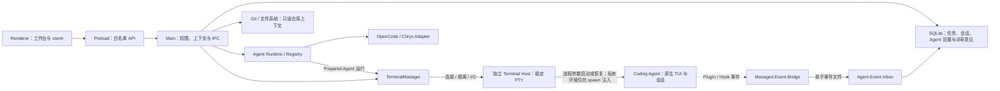

# DevStation 当前状态

DevStation 已完成 M5：用户可在不中断 Agent 终端的情况下查看当前仓库变更、文本 Diff 和文件，并保存本地行级评审意见。下一步进入 M6 AAW 工作流最小适配。

## 当前能力

| 能力         | 状态     | 当前边界                                                                                      |
| ------------ | -------- | --------------------------------------------------------------------------------------------- |
| 桌面工作台   | 可用     | 主区单层并自适应窗口；右栏跟随上下文；重启恢复入口、选中项、树展开和布局                      |
| 任务与项目   | 可用     | 任务经显式确认后创建；列表与详情独立；支持状态、搜索、项目关联及 Git 校验                     |
| 工作会话     | 可用     | 固定 `agentId`，保存结构化原生会话引用、当前运行代次与状态来源                                |
| SQLite       | 可用     | Schema v8；保存 Agent 设置、事件回执与本地评审意见，支持原子迁移与降级拒绝                    |
| PowerShell   | 可用     | AI 主区固定终端；Agent 启动接线不写入可见输入，支持输入、resize 与停止                        |
| PTY 热接回   | 可用     | 独立宿主持有 PTY；支持热接回、诊断和回收；Windows 显式停止会终止完整进程树                    |
| Agent 适配层 | 可用     | Registry、能力描述、结构化 argv、CLI 探测、运行服务、引用校验与契约门禁                       |
| Agent 设置   | 可用     | Schema 驱动字段和接入引导；启停、默认项、CLI、登录与事件集成由 Main 校验                      |
| OpenCode     | 可用     | 启动、恢复、只读会话发现、受管 Plugin 和真实状态事件均封装在 Adapter                          |
| Chrys        | 可用     | 原生 TUI、`-s` 恢复、受管 Hook、会话绑定及工作/等待状态均封装在 Adapter                       |
| 工作流       | 展示占位 | 已有 AAW 流程和模板界面，但尚未连接 CLI、真实状态、产物与持久化                               |
| Agent 事件   | 可用     | OpenCode/Chrys 真实事件、原子文件、重放、坏文件隔离与旧运行拦截                               |
| Git 与评审   | 可用     | 会话右侧是可调宽复合工作区；Diff 和文件预览支持双主题、语法高亮与固定行号，右侧持续保留导航树 |
| Windows 交付 | 基础可用 | NSIS 可构建；打包态 PTY 接回与回收已验收，签名、升级和卸载留到 M7                             |

## 当前用户链路

```text
填写并确认创建任务
→ 添加并关联本地 Git 项目
→ 选择 OpenCode 或 Chrys 创建工作会话
→ 从任务详情创建会话，或在 AI 空间项目上右键创建并打开
→ 自动连接 PowerShell 并启动所选 Agent 的原生 TUI
→ 自动绑定原生会话并显示真实工作、等待、完成或失败状态
→ 页面切换或应用重启时自动回到原工作现场并热接回原 PTY
→ PTY 已结束时用所选 Agent 的原生 Session ID 恢复
→ 在会话右侧复合工作区中通过持续文件树切换 Diff 或文件预览
→ 保存本地行级意见，刷新后无法精确匹配的意见明确标为失效
```

## 运行结构



Renderer 不能提交 cwd、启动参数或环境变量；Git 与文件能力也只接收 `sessionId` 和受约束相对路径，由 Main 解析项目目录并执行固定只读命令。UI 卸载只执行 disconnect，只有用户显式结束才关闭 PTY。

## 主要风险

| ID  | 风险与影响                                      | 处理方向                                     |
| --- | ----------------------------------------------- | -------------------------------------------- |
| R1  | Terminal Host 崩溃仍会丢失活 PTY                | UI 明确断连；已保存原生 ID 时可冷恢复        |
| R2  | OpenCode 数据库结构升级可能影响 Session ID 识别 | 访问集中在只读定位器，增加版本兼容测试       |
| R3  | 原生 Session 被外部删除时，恢复命令可能失败     | 保留终端错误与状态未知标记，不静默创建假状态 |
| R4  | 2 MB 原始终端快照不是完整持久化                 | 快照仅用于热接回；历史事实由原生 Agent 管理  |
| R5  | 超大仓库会触发文件数或输出上限                  | 明确展示截断与超限状态，按需刷新而非持续扫描 |
| R6  | 安装包尚未完成签名、升级和卸载矩阵              | M7 在干净 Windows 环境验收                   |

下一步按[实施计划](./PLAN.md)进入 M6；代码入口见[代码地图](./CODE_MAP.md)。
