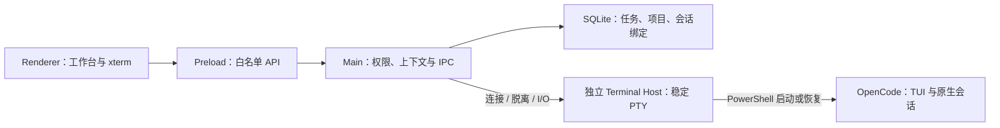

# DevStation 当前状态

DevStation 已完成 M3.2，打通“任务—项目—会话—OpenCode 终端”的本地运行闭环。下一步进入 M4 状态与会话管理；Hook 状态、会话搜索和 Diff 评审尚未完成。

## 当前能力

| 能力         | 状态     | 当前边界                                                               |
| ------------ | -------- | ---------------------------------------------------------------------- |
| 桌面工作台   | 可用     | 主区单层；右栏跟随上下文；重启恢复入口、选中项、树展开和面板布局       |
| 任务与项目   | 可用     | 任务 CRUD、状态、搜索、项目关联与 Git 目录校验                         |
| 工作会话     | 可用     | 按项目树展示，关联任务并固化创建时项目，绑定 OpenCode 原生 Session ID  |
| SQLite       | 可用     | Schema v3、原子迁移、降级拒绝和外键约束                                |
| PowerShell   | 可用     | AI 主区固定终端；输入、resize、有限快照、显式停止和退出原因反馈        |
| PTY 热接回   | 可用     | 独立宿主持有 PTY；支持协议握手、诊断、断连反馈、应用重启接回和空闲回收 |
| OpenCode     | 基础可用 | 新建执行 `opencode`；首次交互后记录原生 ID；PTY 已结束时恢复历史会话   |
| 工作流       | 展示占位 | 已有 AAW 流程和模板界面，但尚未连接 CLI、真实状态、产物与持久化        |
| Agent 状态   | 未完成   | 尚无 Hook、等待用户状态和完成/失败同步                                 |
| Git Diff     | 未完成   | 只有仓库校验；状态、Diff 和评论尚未实现                                |
| Windows 交付 | 基础可用 | NSIS 可构建；打包态 PTY 接回与回收已验收，签名、升级和卸载留到 M7      |

## 当前用户链路

```text
创建任务
→ 添加并关联本地 Git 项目
→ 创建工作会话
→ 从任务详情或 AI 空间项目树打开会话
→ 自动连接 PowerShell 并启动 OpenCode
→ 页面切换或应用重启时自动回到原工作现场并热接回原 PTY
→ PTY 已结束时用 OpenCode 原生 Session ID 恢复
```

## 运行结构



Renderer 不能提交 cwd 或任意启动命令；Main 根据 Project/Session 解析目录和固定命令。UI 卸载只执行 disconnect，只有用户显式结束才关闭 PTY。

## 主要风险

| ID  | 风险与影响                                      | 处理方向                                   |
| --- | ----------------------------------------------- | ------------------------------------------ |
| R1  | Terminal Host 崩溃仍会丢失活 PTY                | UI 明确断连；已保存原生 ID 时可冷恢复      |
| R2  | OpenCode 数据库结构升级可能影响 Session ID 识别 | 访问集中在只读定位器，增加版本兼容测试     |
| R3  | 没有 Hook，界面不能准确展示 Agent 状态          | M4 接入事件并保留终端可用降级路径          |
| R4  | 2 MB 原始终端快照不是完整持久化                 | 快照仅用于热接回；历史事实由 OpenCode 管理 |
| R5  | 安装包尚未完成签名、升级和卸载矩阵              | M6 在干净 Windows 环境验收                 |

下一步按[实施计划](./PLAN.md)进入 M4；代码入口见[代码地图](./CODE_MAP.md)。
