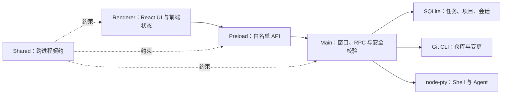

# DevStation 当前状态

DevStation 已具备本地工作管理和基础 Agent 运行底座，可以完成“任务—项目—会话—终端”的前半段链路。Agent 状态跟踪、原生会话恢复和 Diff 评审尚未实现，因此当前版本适合继续研发和内部验证，不适合作为完整 MVP 发布。

## 当前能力

| 能力          | 状态     | 当前边界                                                        |
| ------------- | -------- | --------------------------------------------------------------- |
| 桌面框架      | 可用     | 一级入口驱动二级导航；主区保持单层，右栏跟随当前上下文          |
| 任务管理      | 可用     | 创建、编辑、状态、置顶、搜索、删除确认                          |
| 本地项目      | 可用     | 选择并校验 Git 仓库，限制删除被引用项目                         |
| 工作会话      | 基础可用 | 从任务创建，在 AI 空间按项目树展开和访问；尚无 Agent Session ID |
| SQLite 持久化 | 可用     | Schema v2、原子迁移、降级拒绝、外键约束                         |
| 本地终端      | 基础可用 | 单 Shell/Codex PTY 的启动、输入、resize、退出和清理             |
| Agent 管理    | 未完成   | 未建立 Agent 适配器、Hook、状态同步和恢复命令                   |
| Git 与 Diff   | 未完成   | 仅有本地仓库校验；状态、Diff 和评论尚未实现                     |
| 工作流        | 占位     | 没有可执行工作流编排                                            |
| Windows 交付  | 基础可用 | 可生成 NSIS 安装包；签名、升级和卸载矩阵未完成                  |
| 质量防护      | 可用     | 静态、架构、单元、组件、E2E、PTY、供应链和安装包门禁            |

## 当前用户链路

```text
创建任务
→ 添加并关联本地 Git 项目
→ 创建工作会话
→ 在终端启动 Shell 或 Codex
```

链路在“Agent 状态跟踪、历史恢复、变更评审”处中断，剩余工作见[实施计划](./PLAN.md)。

## 运行结构



依赖方向固定为 Renderer → Preload → Main。Shared 保持平台无关；具体规则由 `.dependency-cruiser.cjs` 执行。

### 核心数据关系

```text
Project 1 ── N Task 1 ── N Session
```

- Task 可以不关联 Project。
- 删除 Task 会级联删除 Session。
- Session 保存创建时的 Project 快照引用。
- 被 Task 或 Session 引用的 Project 不可删除。

字段和约束以 `src/shared/domain.ts` 与 `src/main/db/schema.ts` 为准。

## 稳定决策

| 决策                            | 当前理由                                               |
| ------------------------------- | ------------------------------------------------------ |
| Electron + React                | 复用 Web UI 生态，同时承载本地 PTY、Git 和 SQLite 能力 |
| SQLite 本地优先                 | MVP 不依赖服务端即可保存个人工作状态                   |
| 单一 RPC 通道                   | 集中执行方法白名单、参数校验和错误脱敏                 |
| 不支持 SSH、远程运行和 worktree | 先验证本地研发主链路，避免扩大运行与安全边界           |
| 代码为唯一实现事实              | 文档只提供现状、边界和定位，避免与代码重复维护         |

只有在重新评估难以逆转的决策时才创建 ADR，不为普通实现选择增加文档。

## 主要风险

| ID  | 风险与影响                                                                | 退出条件                                    |
| --- | ------------------------------------------------------------------------- | ------------------------------------------- |
| R1  | 终端尚未绑定任务项目目录，Agent 可能在错误工作目录启动                    | Agent 从任务上下文启动，并有跨进程契约测试  |
| R2  | Session 尚无 Agent 原生 ID 和 Hook，应用只能恢复入口，不能恢复 Agent 对话 | 完成 Agent 适配、Hook 记录和恢复命令        |
| R3  | TerminalPane 缺少跨进程组件测试，订阅清理或异常退出可能出现 UI 回归       | 覆盖创建、数据、退出、取消订阅和卸载链路    |
| R4  | Main 启动和 Preload 白名单缺少定向测试，安全配置可能在重构中退化          | 增加窗口安全、导航、来源校验和 API 契约测试 |
| R5  | 安装包未签名，且尚无真实升级、卸载验证                                    | 建立发布门禁并在干净 Windows 环境验收       |

风险处理顺序与下一阶段任务保持一致，不在本文记录实施过程。
