# DevStation 当前状态

DevStation 已完成 M4：OpenCode 与 Chrys 共用原生 TUI、会话恢复、真实状态事件和统一设置中心；Adapter 描述符、argv、引用、诊断和事件重放均已进入确定性门禁。下一步进入 M5 Git 与 Diff 评审。

## 当前能力

| 能力         | 状态     | 当前边界                                                                |
| ------------ | -------- | ----------------------------------------------------------------------- |
| 桌面工作台   | 可用     | 主区单层；右栏跟随上下文；重启恢复入口、选中项、树展开和面板布局        |
| 任务与项目   | 可用     | 任务 CRUD、状态、搜索、项目关联与 Git 目录校验                          |
| 工作会话     | 可用     | 固定 `agentId`，保存结构化原生会话引用、当前运行代次与状态来源          |
| SQLite       | 可用     | Schema v6；保存 Agent 事件回执与用户 Agent 设置，支持原子迁移与降级拒绝 |
| PowerShell   | 可用     | AI 主区固定终端；输入、resize、有限快照、显式停止和退出原因反馈         |
| PTY 热接回   | 可用     | 独立宿主持有 PTY；支持协议握手、诊断、断连反馈、应用重启接回和空闲回收  |
| Agent 适配层 | 可用     | Registry、能力描述、结构化 argv、CLI 探测、运行服务、引用校验与契约门禁 |
| Agent 设置   | 可用     | 可用性、启停、默认项、CLI 路径、登录终端与事件集成诊断                  |
| OpenCode     | 可用     | 启动、恢复、只读会话发现、受管 Plugin 和真实状态事件均封装在 Adapter    |
| Chrys        | 可用     | 原生 TUI、`-s` 恢复、受管 Hook、会话绑定及工作/等待状态均封装在 Adapter |
| 工作流       | 展示占位 | 已有 AAW 流程和模板界面，但尚未连接 CLI、真实状态、产物与持久化         |
| Agent 事件   | 可用     | OpenCode/Chrys 真实事件、原子文件、重放、坏文件隔离与旧运行拦截         |
| Git Diff     | 未完成   | 只有仓库校验；状态、Diff 和评论尚未实现                                 |
| Windows 交付 | 基础可用 | NSIS 可构建；打包态 PTY 接回与回收已验收，签名、升级和卸载留到 M7       |

## 当前用户链路

```text
创建任务
→ 添加并关联本地 Git 项目
→ 选择 OpenCode 或 Chrys 创建工作会话
→ 从任务详情或 AI 空间项目树打开会话
→ 自动连接 PowerShell 并启动所选 Agent 的原生 TUI
→ 自动绑定原生会话并显示真实工作、等待、完成或失败状态
→ 页面切换或应用重启时自动回到原工作现场并热接回原 PTY
→ PTY 已结束时用所选 Agent 的原生 Session ID 恢复
```

## 运行结构

```mermaid
flowchart LR
    UI["Renderer：工作台与 xterm"]
    Preload["Preload：白名单 API"]
    Main["Main：权限、上下文与 IPC"]
    DB["SQLite：任务、项目、会话绑定与 Agent 设置"]
    Runtime["Agent Runtime / Registry"]
    Adapter["OpenCode / Chrys Adapter"]
    Bridge["Managed Event Bridge"]
    Inbox["Agent Event Inbox"]
    Terminal["TerminalManager"]
    Host["独立 Terminal Host：稳定 PTY"]
    Agent["Coding Agent：原生 TUI 与会话"]

    UI --> Preload --> Main
    Main --> DB
    Main --> Runtime --> Adapter
    Main --> Terminal
    Runtime -->|Prepared Agent 运行| Terminal
    Terminal -->|连接 / 脱离 / I/O| Host
    Host -->|PowerShell 启动或恢复| Agent
    Agent -.->|Plugin / Hook 事件| Bridge
    Bridge -->|原子事件文件| Inbox --> DB
```



Renderer 不能提交 cwd、启动参数或环境变量；Adapter 生成结构化参数，经 Main 校验和 PowerShell 编码后交给终端。UI 卸载只执行 disconnect，只有用户显式结束才关闭 PTY。

## 主要风险

| ID  | 风险与影响                                      | 处理方向                                     |
| --- | ----------------------------------------------- | -------------------------------------------- |
| R1  | Terminal Host 崩溃仍会丢失活 PTY                | UI 明确断连；已保存原生 ID 时可冷恢复        |
| R2  | OpenCode 数据库结构升级可能影响 Session ID 识别 | 访问集中在只读定位器，增加版本兼容测试       |
| R3  | 原生 Session 被外部删除时，恢复命令可能失败     | 保留终端错误与状态未知标记，不静默创建假状态 |
| R4  | 2 MB 原始终端快照不是完整持久化                 | 快照仅用于热接回；历史事实由原生 Agent 管理  |
| R5  | 安装包尚未完成签名、升级和卸载矩阵              | M7 在干净 Windows 环境验收                   |

下一步按[实施计划](./PLAN.md)进入 M5；代码入口见[代码地图](./CODE_MAP.md)。
